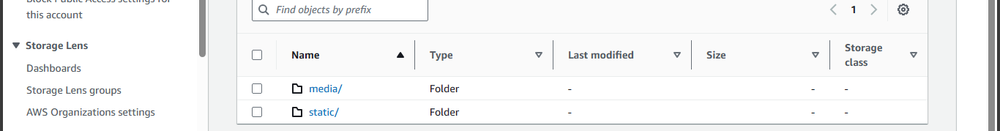

# Soft - Fire 


### Cross Platform and Licence


### App description
An innovative web app, seamlessly integrates **Python and JS** to create a dynamic game canvas, delivering an immersive gaming experience. Soft Fire stands out by allowing users to upload and showcase their games within its integrated store. Moreover, it streamlines development with a unique feature, leveraging Node.js and Webpack to convert TypeScript (.ts) and SCSS (.scss) to JavaScript and CSS, making Soft Fire a comprehensive and solution-oriented tool for game creation and management.


# ChangeLog

| Version |  Publicized  |   What's New
----------|--------------|---------          
|1.0.0    | 2024-01-19   | Initial release 
|2.4.0    | 2024-03-02   | Ui and feel, Template to upload game properties. File conversion & Download (Ts to Js & .scss to .css), S3 storage system.|
|2.5.0    |2024-03-04    |Database Engine : PostgreSQL|


**Soft Fire** is designed for continuous improvement, with ongoing **Minor** patches delivering new features and enhanced security. Its dynamic nature ensures that development remains active, guaranteeing a cutting-edge experience for users as the software evolves over time.</br>
With that being said, feel free to report any issue, and if you have any ideas to improve the software, You should submit a pull request. I'll gladly review the code and merge if necessary.


## Installation 
  
* Open the terminal in Visual Studio Code. You can use shortcut <kbd>Ctrl</kbd>+<kbd>`</kbd>

* Use the **cd** command to navigate to the directory where you would like to clone the repository.
  
* Install VirtualEnv if not already installed `pip install virtualenv`
* Create a virtual environment  `virtualenv 'environment-name'`
* Activate the environment **Windows** - `.\enviroonment-name\Scripts\activate.bat` **macOS/Linux** - `source environment-name/bin/activate`
   
* Use  `git clone https://github.com/harkerbyte/soft-fire` to have the repository cloned.
* Navigate to the project directory **cd** C:\<directory-path>

* Install the software's Dependencies. Run `pip install -r requirements.txt` 
* Run Migrations `py manage.py migrate`
  
* To start the project. Run `py manage.py runserver` Now open `127.0.0.1:8000` on your browser.

  

## Notice
* For any **html** file to be uploaded. . .It content must be similar to this:
  
```html
<div id="container">
  <div id="game"></div>
  <div id="score">0</div>
  <div id="instructions">Click (or press the spacebar) to place the block</div>
  <div class="game-over">
    <h2>Game Over</h2>
    <p>You did great, you're the best.</p>
    <p>Click or spacebar to start again</p>
  </div>
  <div class="game-ready">
    <div id="start-button">Start</div>
    <div></div>
  </div>
</div>
```

* It only need the raw HTML code since it will be incorporated using the **{{html_content|safe}}** variable tag, eliminating the necessity for a complete HTML structure with headers and bodies. This approach ensures flexibility in inserting HTML content directly into the templates. 
 A work - around could be available later on as the software's development progresses.


*  If you're committed to this project, I recommend leaving the   production value as the default. Assigning ```bool(True)``` to this    variable will signal the software to assume a deployment to production, necessitating the creation of an S3 bucket and an RDS.

* While configuring the S3 bucket may seem strenuous, I've already  completed 80% of the job. You can proceed to create and configure the server side. Meanwhile, refer to the next section for guidance on filling in the necessary credentials.
```
   'static'
   'media'
```



  
## Production Guide 
* Inside the project's folder named *.credentials*, you'll find two empty files:
  * **.env** for S3 credentials
  * **db** for RDS credentials

* The software's current configured database is *PostgreSQL; remember this when selecting your **database engine**.

* Once you've submitted the necessary cloud resource credentials to the aforementioned files, proceed to assign bool(True) to the *production variable*.

* Now run ```py manage.py migrate```

* **Note**: Currently, this API lacks a command to collect media files for upload to the S3 bucket. A workaround command will be available soon as the software's development progresses. I recommend manually uploading the folders to your S3 bucket. Once done, you can proceed to run the project, as the software will handle serving the media files.
